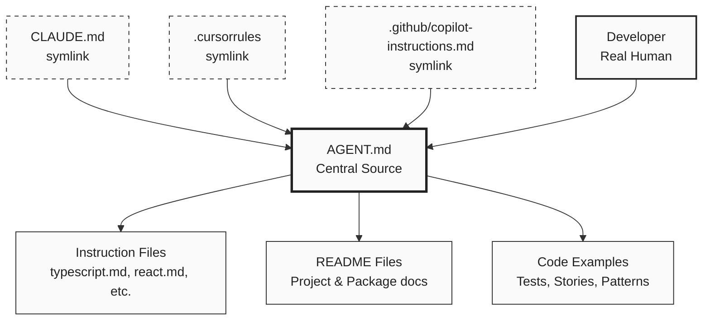

# Instructions Directory Overview

This directory contains all instruction files that guide AI assistants and developers in maintaining consistent code quality and following established patterns.

## Documentation Flow

Each AI assistant tool enters through its own symlink, but they all point to the central `AGENT.md` file. This central file acts as the single source of truth that references the appropriate documentation without duplicating content.

## Documentation Philosophy

### Structure

- **AGENT.md**: Central source of truth, index pointing to resources, not duplicating content
- **Instruction files** (.github/instructions/\*.instructions.md): Language/framework-specific rules and patterns
  - All instruction files must follow the naming pattern `*.instructions.md`
  - Examples: `git.instructions.md`, `typescript.instructions.md`, `react.instructions.md`
- **README files**: Setup, usage, and overview information
  - Root README: Project overview and quick start
  - App/package READMEs: Specific setup and usage for that module
- **Code examples**: Actual implementation patterns (stories, tests, example components)

### Principles

- Each document has ONE clear purpose
- Avoid duplicating information across files
- Reference other docs instead of repeating content
- More specific docs deeper in directory tree
- Keep instructions actionable and concise

## Keep Documentation Updated

**When making architectural changes or adding new tools/patterns:**

1. Update the relevant documentation files to reflect changes
2. This ensures all AI assistants have accurate, current information
3. Include: new commands, changed workflows, updated dependencies, new patterns
4. Remove: deprecated commands, old patterns, removed dependencies

Examples of changes that require updates:

- Adding/removing packages or dependencies
- Changing build/test commands
- Modifying project structure
- Updating development workflows
- Changing environment variables or ports
- Adopting new conventions or patterns

## How to Add New Instruction Files

1. Create a new file following the naming pattern: `<topic>.instructions.md`
2. Focus on ONE specific technology or pattern
3. Include practical examples and clear guidelines
4. Update AGENT.md to reference the new instruction file
